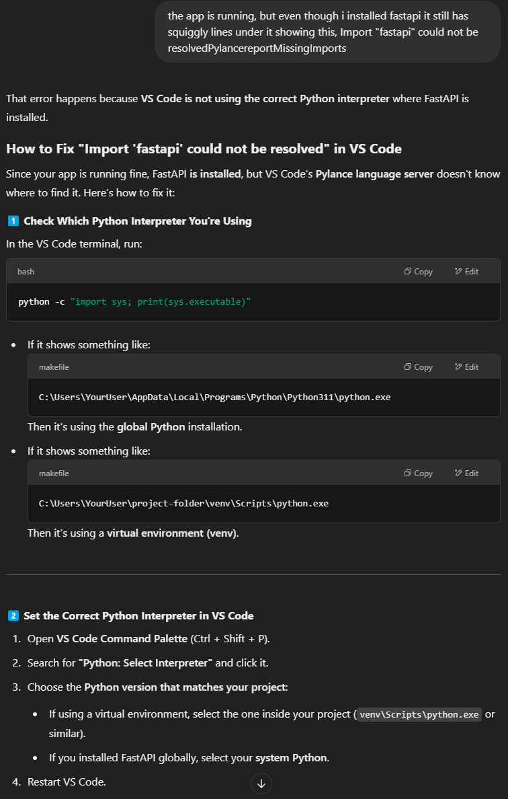

pip install fastapi uvicorn

create a file, main.py, add your http code

uvicorn main:app --reload

____

***

pip freeze > requirements.txt

>
fastapi
uvicorn
pydantic
sqlalchemy
>
***

python -m venv venv

venv\Scripts\activate

*** when your inside the virtual env, not system wide ***
pip install -r requirements.txt

deactivate

*** uninstall ex. ***
pip uninstall fastapi uvicorn

*** for package errors ***

http://localhost:8000/